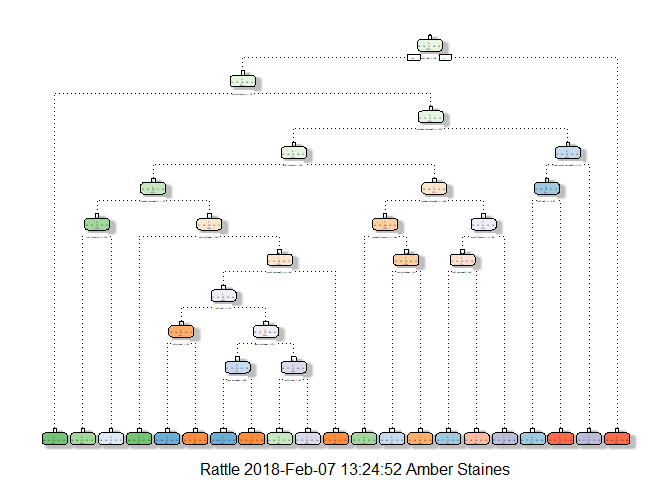
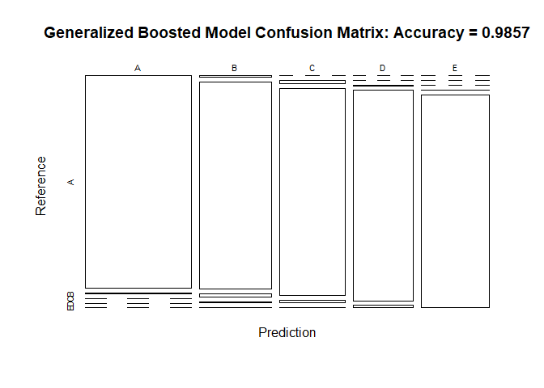

## Introduction
### Background
This project was done as part of the Coursera Practical Machine Learning Course as part of the Data Science Specialization.

Using devices such as Jawbone Up, Nike FuelBand, and Fitbit it is now possible to collect a large amount of data about personal activity relatively inexpensively. These type of devices are part of the quantified self movement - a group of enthusiasts who take measurements about themselves regularly to improve their health, to find patterns in their behavior, or because they are tech geeks. One thing that people regularly do is quantify how much of a particular activity they do, but they rarely quantify how well they do it. In this project, your goal will be to use data from accelerometers on the belt, forearm, arm, and dumbell of 6 participants. They were asked to perform barbell lifts correctly and incorrectly in 5 different ways. More information is available from the website here:   
   
http://web.archive.org/web/20161224072740/http:/groupware.les.inf.puc-rio.br/har (see the section on the Weight Lifting Exercise Dataset).

### Data

The training data for this project are available here:

https://d396qusza40orc.cloudfront.net/predmachlearn/pml-training.csv

The test data are available here:

https://d396qusza40orc.cloudfront.net/predmachlearn/pml-testing.csv


The data for this project come from this source: http://web.archive.org/web/20161224072740/http:/groupware.les.inf.puc-rio.br/har

### Environment set up

```r
library(caret)
library(rpart)
library(rpart.plot)
library(RColorBrewer)
library(rattle)
library(randomForest)
library(corrplot)
library(knitr)
```

### Loading in the data
Next, we load in the data from the provided URLs:  

```r
trainUrl <- "http://d396qusza40orc.cloudfront.net/predmachlearn/pml-training.csv"
testUrl <- "http://d396qusza40orc.cloudfront.net/predmachlearn/pml-testing.csv"
training <- read.csv(url(trainUrl), na.strings=c("NA","#DIV/0!",""))
testing <- read.csv(url(testUrl), na.strings=c("NA","#DIV/0!",""))
```

Now, we partition the training data into training and testing sets. The training set will account for 70% of the data and the testing set will account for 30%. The original testing data will remain untouched.

```r
in_train <- createDataPartition(y=training$classe, p=0.6, list=FALSE)
training_data <- training[in_train, ]; testing_data <- training[-in_train, ]
dim(training_data); dim(testing_data)
```

```
## [1] 11776   160
```

```
## [1] 7846  160
```

### Cleaning the data
First, we want to remove variables with near-zero variance: 

```r
NZV <- nearZeroVar(training_data)
training_data <- training_data[, -NZV]; testing_data  <- testing_data[, -NZV]
dim(training_data); dim(testing_data)
```

```
## [1] 11776   131
```

```
## [1] 7846  131
```

Then, we want to remove variables with a high percentage of NA values (95% or higher): 

```r
NAS   <- sapply(training_data, function(x) mean(is.na(x))) > 0.95
training_data <- training_data[, NAS==FALSE]; testing_data  <- testing_data[, NAS==FALSE]
dim(training_data); dim(testing_data)
```

```
## [1] 11776    59
```

```
## [1] 7846   59
```

Finally, we want to remove the ID variales, or the first 5 rows: 

```r
training_data <- training_data[, -(1:5)]; testing_data  <- testing_data[, -(1:5)]
dim(training_data); dim(testing_data)
```

```
## [1] 11776    54
```

```
## [1] 7846   54
```

## Choosing a Model: 
We will apply three methods for modeling this data: random forrest model, decision trees, and a generalized boosted model. The one with the highest accuracy will be used on the testing data set. 

### Random Forrest Model: 

```r
set.seed(12345)
random_forrest_control <- trainControl(method="cv", number=3, verboseIter=FALSE)
random_forrest_model <- train(classe ~ ., data=training_data, method="rf",
                          trControl=random_forrest_control)
random_forrest_model$finalModel
```

```
## 
## Call:
##  randomForest(x = x, y = y, mtry = param$mtry) 
##                Type of random forest: classification
##                      Number of trees: 500
## No. of variables tried at each split: 27
## 
##         OOB estimate of  error rate: 0.31%
## Confusion matrix:
##      A    B    C    D    E class.error
## A 3348    0    0    0    0 0.000000000
## B    5 2270    4    0    0 0.003949100
## C    0    7 2045    2    0 0.004381694
## D    0    0   13 1916    1 0.007253886
## E    0    1    0    4 2160 0.002309469
```

Now, we will create a confusion matrix to test the accuracy of this model: 

```r
random_forrest_predict <- predict(random_forrest_model, newdata=testing_data)
random_forrest_confusion <- confusionMatrix(random_forrest_predict, testing_data$classe)
random_forrest_confusion
```

```
## Confusion Matrix and Statistics
## 
##           Reference
## Prediction    A    B    C    D    E
##          A 2231    2    0    0    0
##          B    0 1509    4    0    0
##          C    0    6 1364    4    0
##          D    0    1    0 1281    0
##          E    1    0    0    1 1442
## 
## Overall Statistics
##                                           
##                Accuracy : 0.9976          
##                  95% CI : (0.9962, 0.9985)
##     No Information Rate : 0.2845          
##     P-Value [Acc > NIR] : < 2.2e-16       
##                                           
##                   Kappa : 0.9969          
##  Mcnemar's Test P-Value : NA              
## 
## Statistics by Class:
## 
##                      Class: A Class: B Class: C Class: D Class: E
## Sensitivity            0.9996   0.9941   0.9971   0.9961   1.0000
## Specificity            0.9996   0.9994   0.9985   0.9998   0.9997
## Pos Pred Value         0.9991   0.9974   0.9927   0.9992   0.9986
## Neg Pred Value         0.9998   0.9986   0.9994   0.9992   1.0000
## Prevalence             0.2845   0.1935   0.1744   0.1639   0.1838
## Detection Rate         0.2843   0.1923   0.1738   0.1633   0.1838
## Detection Prevalence   0.2846   0.1928   0.1751   0.1634   0.1840
## Balanced Accuracy      0.9996   0.9967   0.9978   0.9980   0.9998
```

Finally, we will plot the confusion matrix results: 

```r
plot(random_forrest_confusion$table, col = random_forrest_confusion$byClass, main = paste("Random Forrest Confusion Matrix: Accuracy =", round(random_forrest_confusion$overall['Accuracy'], 4)))
```

<!-- -->

### Decision Tree: 

```r
set.seed(12345)
decision_tree_model <- rpart(classe ~ ., data=training_data, method="class")
fancyRpartPlot(decision_tree_model)
```

<!-- -->

Now, we will create a confusion matrix to test the accuracy of this model: 

```r
decision_tree_predict <- predict(decision_tree_model, testing_data, type = "class")
decision_tree_confusion <- confusionMatrix(decision_tree_predict, testing_data$classe)
decision_tree_confusion
```

```
## Confusion Matrix and Statistics
## 
##           Reference
## Prediction    A    B    C    D    E
##          A 1978  250   60   86   76
##          B   90  894   49   93  150
##          C   21   97 1101  185  139
##          D  116  190   77  853  178
##          E   27   87   81   69  899
## 
## Overall Statistics
##                                           
##                Accuracy : 0.7297          
##                  95% CI : (0.7197, 0.7395)
##     No Information Rate : 0.2845          
##     P-Value [Acc > NIR] : < 2.2e-16       
##                                           
##                   Kappa : 0.6572          
##  Mcnemar's Test P-Value : < 2.2e-16       
## 
## Statistics by Class:
## 
##                      Class: A Class: B Class: C Class: D Class: E
## Sensitivity            0.8862   0.5889   0.8048   0.6633   0.6234
## Specificity            0.9159   0.9396   0.9318   0.9145   0.9588
## Pos Pred Value         0.8073   0.7006   0.7135   0.6033   0.7730
## Neg Pred Value         0.9529   0.9050   0.9576   0.9327   0.9187
## Prevalence             0.2845   0.1935   0.1744   0.1639   0.1838
## Detection Rate         0.2521   0.1139   0.1403   0.1087   0.1146
## Detection Prevalence   0.3123   0.1626   0.1967   0.1802   0.1482
## Balanced Accuracy      0.9011   0.7643   0.8683   0.7889   0.7911
```

Finally, we will plot the confusion matrix results: 

```r
plot(decision_tree_confusion$table, col = decision_tree_confusion$byClass, main = paste("Decision Tree Confusion Matrix: Accuracy =", round(decision_tree_confusion$overall['Accuracy'], 4)))
```

<!-- -->

### Generalized Boosted Model: 

```r
set.seed(12345)
GBM_control <- trainControl(method = "repeatedcv", number = 5, repeats = 1)
GBM_model  <- train(classe ~ ., data=training_data, method = "gbm",
                    trControl = GBM_control, verbose = FALSE)
```

```
## Warning: package 'gbm' was built under R version 3.3.3
```

```
## Loading required package: survival
```

```
## Warning: package 'survival' was built under R version 3.3.3
```

```
## 
## Attaching package: 'survival'
```

```
## The following object is masked from 'package:caret':
## 
##     cluster
```

```
## Loading required package: splines
```

```
## Loading required package: parallel
```

```
## Loaded gbm 2.1.3
```

```
## Warning: package 'plyr' was built under R version 3.3.3
```

```r
GBM_model$finalModel
```

```
## A gradient boosted model with multinomial loss function.
## 150 iterations were performed.
## There were 53 predictors of which 42 had non-zero influence.
```

Now, we will create a confusion matrix to test the accuracy of this model: 

```r
GBM_predict <- predict(GBM_model, newdata=testing_data)
GBM_confusion <- confusionMatrix(GBM_predict, testing_data$classe)
GBM_confusion
```

```
## Confusion Matrix and Statistics
## 
##           Reference
## Prediction    A    B    C    D    E
##          A 2222    8    0    0    0
##          B   10 1490   25    9    2
##          C    0   20 1340   18    2
##          D    0    0    3 1258   14
##          E    0    0    0    1 1424
## 
## Overall Statistics
##                                           
##                Accuracy : 0.9857          
##                  95% CI : (0.9828, 0.9882)
##     No Information Rate : 0.2845          
##     P-Value [Acc > NIR] : < 2.2e-16       
##                                           
##                   Kappa : 0.9819          
##  Mcnemar's Test P-Value : NA              
## 
## Statistics by Class:
## 
##                      Class: A Class: B Class: C Class: D Class: E
## Sensitivity            0.9955   0.9816   0.9795   0.9782   0.9875
## Specificity            0.9986   0.9927   0.9938   0.9974   0.9998
## Pos Pred Value         0.9964   0.9701   0.9710   0.9867   0.9993
## Neg Pred Value         0.9982   0.9956   0.9957   0.9957   0.9972
## Prevalence             0.2845   0.1935   0.1744   0.1639   0.1838
## Detection Rate         0.2832   0.1899   0.1708   0.1603   0.1815
## Detection Prevalence   0.2842   0.1958   0.1759   0.1625   0.1816
## Balanced Accuracy      0.9970   0.9871   0.9867   0.9878   0.9937
```

Finally, we will plot the confusion matrix results: 

```r
plot(GBM_confusion$table, col = GBM_confusion$byClass, main = paste("Generalized Boosted Model Confusion Matrix: Accuracy =", round(GBM_confusion$overall['Accuracy'], 4)))
```

<!-- -->


## Conclusions
The accuracy of the 3 modeling methods are:
* Random Forest: 0.996
* Decision Tree: 0.709
* GBM: 0.987

Therefore, we choose to appy the Random Forrest Model to the testing dataset: 

```r
final_predict <- predict(random_forrest_model, newdata=testing)
final_predict
```

```
##  [1] B A B A A E D B A A B C B A E E A B B B
## Levels: A B C D E
```


