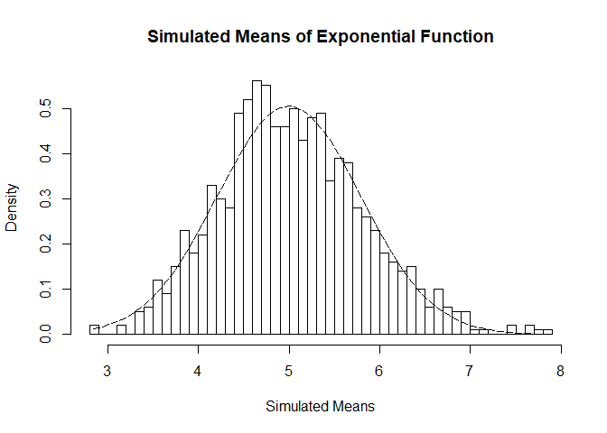

# Part 1: 
### Overview
This project was done as part of the Coursera Statistical Inference Course as part of the Data Science Specialization.

In this project I investigated the exponential distribution in R and compared it with the Central Limit Theorem.  The exponential distribution can be simulated in R with rexp(n, lambda) where lambda is the rate parameter. The mean of exponential distribution is 1/lambda and the standard deviation is also 1/lambda. I investigated the distribution of averages of 40 exponentials and did 1,000 simulations.For this project lambda = 0.2 for all of the simulations. 

### Simulations
First, we set the seed for reproducability. Then, we set up the parameters listed in the overview section. 

```r
set.seed(525)
lambda <- 0.2 
n <- 40 
sim <- 1000
```

Next, we simulate the exponential distribution and calculate the means the exponential simulations. We then plot a histogram of the simulated means. 

```r
sim_exp <- replicate(sim, rexp(n, lambda))
mean_exp <- apply(sim_exp, 2, mean)

hist(mean_exp, breaks=20, main="Simulated Means of Exponential Function", xlab="Simulated Means")
```

<!-- -->

### Question 1: Sample Mean vs. Theoretical Mean
The theoretical mean of the exponential distribtution is 1/lambda or 1/0.2 = 5.  
Now, let's look at the sample mean: 

```r
hist(mean_exp, breaks=20, main="Simulated Means of Exponential Function", xlab="Simulated Means")
abline(v=mean(mean_exp), lwd="4", col="red")
```

<!-- -->

We can see that the red line, which represents the sample mean, lies very close to 5. However, let's look at the exact number: 

```r
mean(mean_exp)
```

```
## [1] 5.028122
```

Our sample mean is 5.028, which is very close to our theoretical mean of 5. 

### Question 2: Sample Variance vs. Theoretical Variance
The theoretical standard deviation of the exponential distribution is equal to (1/lambda)/sqrt(n) or 5/sqrt(40) = 0.7906.  
The theoretical variance is equal to ((1/lambda)/sqrt(n))^2 or 0.7906^2 = 0.625.  
Now, let's look at the sample standard deviation: 

```r
sd(mean_exp)
```

```
## [1] 0.7925266
```

And the sample variance:

```r
sd(mean_exp)^2
```

```
## [1] 0.6280984
```

A sample standard deviation of 0.7925 is close to 0.7906 and a sample variance of 0.628 is very close to 0.625. 

### Question 3: Distribution

Finally, I investigate whether the exponential distribution is approximately normal. The Central Limit Theorem tells us that the means of the sample simulations should closely follow a normal distribution. Let's compare the normal distribution to the distribution of the simulated means: 

```r
hist(mean_exp, prob=TRUE, breaks=40, main="Simulated Means of Exponential Function", xlab="Simulated Means")
x <- seq(min(mean_exp), max(mean_exp), length=100)
y <- dnorm(x, mean=1/lambda, sd=(1/lambda/sqrt(n)))
lines(x, y, pch=22, col="black", lty=5)
```

<!-- -->

From the above plot, we can see that the distribution of the simulated means is close to the normal distribution. We can also use a Normal Q-Q Plot to further examine how close the distribution is to the normal distributution: 

```r
qqnorm(mean_exp)
qqline(mean_exp)
```

<!-- -->

Again, we can see that the simulated means approximately follow a normal distribution.

# Part 2: 
### Load packages and data: 

```r
library(ggplot2)
library(datasets)
data(ToothGrowth)
```

### Summarize the data: 

```r
str(ToothGrowth)
```

```
## 'data.frame':	60 obs. of  3 variables:
##  $ len : num  4.2 11.5 7.3 5.8 6.4 10 11.2 11.2 5.2 7 ...
##  $ supp: Factor w/ 2 levels "OJ","VC": 2 2 2 2 2 2 2 2 2 2 ...
##  $ dose: num  0.5 0.5 0.5 0.5 0.5 0.5 0.5 0.5 0.5 0.5 ...
```
  

```r
summary(ToothGrowth)
```

```
##       len        supp         dose      
##  Min.   : 4.20   OJ:30   Min.   :0.500  
##  1st Qu.:13.07   VC:30   1st Qu.:0.500  
##  Median :19.25           Median :1.000  
##  Mean   :18.81           Mean   :1.167  
##  3rd Qu.:25.27           3rd Qu.:2.000  
##  Max.   :33.90           Max.   :2.000
```

We need to transform the dose variable into a factor variable: 

```r
ToothGrowth$dose<-as.factor(ToothGrowth$dose)
```

Now let's use plots to explore the relationship between supplement, dose, and tooth length: 

```r
g <- ggplot(aes(x=supp, y=len), data=ToothGrowth) 
g <- g + geom_boxplot(aes(fill=supp))
g <- g + ggtitle("Average Tooth Length by Supplement Type")
g <- g + xlab("Supplement type") 
g <- g + ylab("Tooth length")
g
```

<!-- -->
  

```r
g2 <- ggplot(aes(x=dose, y=len), data=ToothGrowth) 
g2 <- g2 + geom_boxplot(aes(fill=dose))
g2 <- g2 + ggtitle("Average Tooth Length by Dosage")
g2 <- g2 + xlab("Dose (mg)") 
g2 <- g2 + ylab("Tooth length")
g2
```

<!-- -->

### Use t-tests and confidence intervals to compare tooth growth by supplement and dose: 
First, let's test the null hypothesis that average tooth length is not different for the different supplements: 

```r
t.test(len~supp,data=ToothGrowth)
```

```
## 
## 	Welch Two Sample t-test
## 
## data:  len by supp
## t = 1.9153, df = 55.309, p-value = 0.06063
## alternative hypothesis: true difference in means is not equal to 0
## 95 percent confidence interval:
##  -0.1710156  7.5710156
## sample estimates:
## mean in group OJ mean in group VC 
##         20.66333         16.96333
```
A p-value of 0.06 and a confidence interval that contains 0 tells us that we cannot reject the null hypothesis that the average tooth length is the same for both supplement types. 
  
Now, let's test the null hypothesis that the mean tooth length is equal across all three dosage levels. We will do this by testing each pair of doses separately, which will require three tests. First, we need to create subsets of data for each dosage pair: 

```r
ToothGrowth_doses_0.5_1.0 <- subset (ToothGrowth, dose %in% c(0.5, 1.0)) 
ToothGrowth_doses_0.5_2.0 <- subset (ToothGrowth, dose %in% c(0.5, 2.0)) 
ToothGrowth_doses_1.0_2.0 <- subset (ToothGrowth, dose %in% c(1.0, 2.0))
```

First, we test the null hypothesis that the mean tooth length is equal for the 0.5mg dose and the 1mg dose:

```r
t.test(len~dose,data=ToothGrowth_doses_0.5_1.0)
```

```
## 
## 	Welch Two Sample t-test
## 
## data:  len by dose
## t = -6.4766, df = 37.986, p-value = 1.268e-07
## alternative hypothesis: true difference in means is not equal to 0
## 95 percent confidence interval:
##  -11.983781  -6.276219
## sample estimates:
## mean in group 0.5   mean in group 1 
##            10.605            19.735
```
Second, we test the null hypothesis that the mean tooth length is equal for the 0.5mg dose and the 2mg dose:

```r
t.test(len~dose,data=ToothGrowth_doses_0.5_2.0)
```

```
## 
## 	Welch Two Sample t-test
## 
## data:  len by dose
## t = -11.799, df = 36.883, p-value = 4.398e-14
## alternative hypothesis: true difference in means is not equal to 0
## 95 percent confidence interval:
##  -18.15617 -12.83383
## sample estimates:
## mean in group 0.5   mean in group 2 
##            10.605            26.100
```
Finally, we test the null hypothesis that the mean tooth length is equal for the 1mg dose and the 2mg dose:

```r
t.test(len~dose,data=ToothGrowth_doses_1.0_2.0)
```

```
## 
## 	Welch Two Sample t-test
## 
## data:  len by dose
## t = -4.9005, df = 37.101, p-value = 1.906e-05
## alternative hypothesis: true difference in means is not equal to 0
## 95 percent confidence interval:
##  -8.996481 -3.733519
## sample estimates:
## mean in group 1 mean in group 2 
##          19.735          26.100
```

All three t-tests give us p-values of approximately 0 and confidence intervals that do not contain zero. Therefore, we can reject the null hypothesis and assume that tooth length increases with increased doses. 

### Conclusions and assumptions: 
**Conclusion**: The supplement type (OJ vs. VC) did not affect average tooth length. The dose amount (0.5, 1, and 2 mg) did affect tooth length. As dose amount increases, average tooth length also increases. 

**Assumptions**:  
1. The sample is representative of the population.  
2. There are no confounding factors affecting tooth legnth. 
  
  
  


